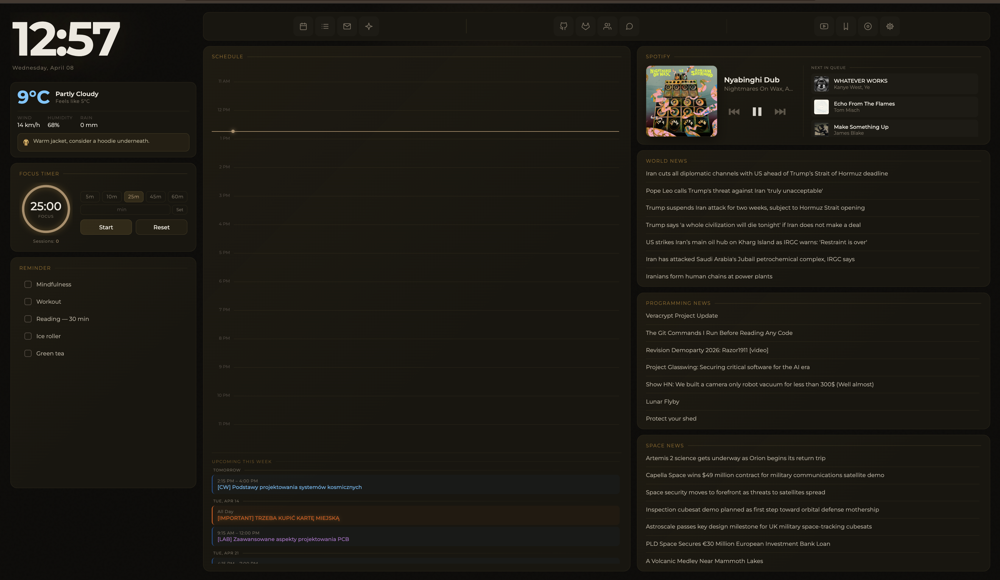
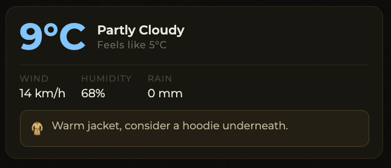
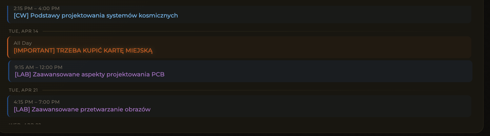
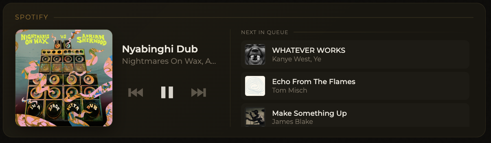

# 🐧 Linux Setup

Repozytorium zawierające konfigurację mojego środowiska

---

## 🖥️ System & Desktop Environment
- **OS:** [Debian GNU/Linux](https://www.debian.org/) (Stable/Testing)
- **DE:** [GNOME](https://www.gnome.org/)
- **Theme:** Adw-gtk3 + Papirus Icons

### GNOME Extensions
- **Just Perfection:** Minimalizm i usuwanie zbędnych elementów UI.
- **Blur my Shell:** Estetyczne rozmycie panelu i podglądu.

---

## 🐚 Terminal Stack

Używam [Ghostty]() - konfiguracja w pliku `ghostty-config`. Moja powłoka to **Zsh** zarządzana przez **Oh-My-Zsh** z motywem **Starship**. 
Używam również **Tmux** do zarządzania sesjami i podziału terminala.

Mój plik `.zshrc` znajduje się w `zshrc`.

### Zsh Plugins
- `zsh-autosuggestions` - Podpowiedzi na podstawie historii.
- `zsh-syntax-highlighting` - Kolorowanie komend w czasie rzeczywistym.
- `fzf-tab` - Fzf zamiast standardowego menu tab-completion.

### 🪟 Tmux Configuration
- **Manager wtyczek:** [TPM](https://github.com/tmux-plugins/tpm)
- **Główne wtyczki:**
  - `tmux-resurrect`: Przywracanie sesji po restarcie.
  - `tmux-continuum`: Automatyczny zapis stanu.
  - `catppuccin/tmux`: Motyw paska statusu.

konfiguracja w pliku `tmux-config`

### Podstawowe narzędzia i ich zamienniki:
| Narzędzie | Zamiennik dla | Opis |
| :--- | :--- | :--- |
| `eza` | `ls` | Nowoczesne listowanie plików z kolorami i ikonami. |
| `bat` | `cat` | Wyświetlanie plików z podświetlaniem składni. |
| `fzf` | `CTRL+R` | Rozmyte wyszukiwanie w historii i plikach. |
| `zoxide` | `cd` | Inteligentna nawigacja po katalogach. |
| `gtop` | `top` | Interaktywny monitor zasobów systemowych. |

---

## My programming setup

- [ZED](https://zed.dev/) - main IDE
- [nvim](https://neovim.io/) - for quick edits in terminal

- [Docker](https://www.docker.com/) - of course!
- [DBeaver](https://dbeaver.io/) - Free, open source DB client
- [Bruno](https://www.usebruno.com) - Free, open source API client

- [Lazy GIT](https://github.com/jesseduffield/lazygit)
- [Git custom configuration](https://github.com/KarolBorecki/setup/blob/master/,gitconfig)
  
---

## Everyday tools:

- [Flamshot]() - screenshots
- [Pano]([https://copyq.net/](https://extensions.gnome.org/extension/5278/pano/)) - clipboard manager
- [Gimp]() - Vector images manipulation tool
- [Draw.io]() - Diagrams
- [VLC]() - media player
- [Evince]() - PDF viewer 
- [Neovide]() - Neovim GUI
- [Bitwarden]() - password manager
- [Notion]() - note-taking app
- [Eye of GNOME]() - image viewer

---

## Interesting applications I use

- [Little snitch](https://obdev.at/products/littlesnitch-linux/index.html) - an desktop app allowing more control over network connections made by apps inside my system.

---

## My programming setup

- [ZED](https://zed.dev/) - main IDE

- [Docker](https://www.docker.com/) - of course!
- [DBeaver](https://dbeaver.io/) - Free, open source DB client
- [Bruno](https://www.usebruno.com) - Free, open source API client

- [Lazy GIT](https://github.com/jesseduffield/lazygit) - greate gui for git!


### MacOS

- [RayCast](https://www.raycast.com/) - Interesting shortcut app

---

## 🌐 Custom Browser Dashboard (GitHub Pages)

Zamiast standardowej strony nowej karty, używam własnego dashboardu hostowanego na **GitHub Pages**.



### Funkcje:
- **Quick Links:** - Skróty do najczęściej używanych narzędzi.
- **Status:** - Podpięte API pogodowe oraz zegar wraz z customowymi informacjami co do sugerowanego ubioru - zawsze mam z tym problem!


- **Integracja z Apple Calendar** - Mój kalendarz jest dość specyficzny, więc musiałem napisać własny skrypt do pobierania wydarzeń i wyświetlania ich na dashboardzie. Dodałem customowe kolorowanie w zależności od prefixów dzięki temu lepiej zarządzam swoim czasem i zadaniami.


- **Integracja z Spotify** - Wyświetlanie aktualnie odtwarzanego utworu i możliwość sterowania odtwarzaniem bezpośrednio z dashboardu. Życie bez muzyki nie istnieje.


- **Karty z interesującymi mnie Newsami** - Połączyłem wiele API, aby wyłuskać wszystko co najciekawsze - skanuję głównie subreddity żeby zawsze mieć dostęp do świeżych informacji z 3 interesujących mnie kategorii: świat (klasyk), programowanie oraz space.
- **Pomodoro:** - Prosty timer, przydaje się też do pieczenia chleba.

### Jak to działa?
1. Dashboard jest zbudowany jako statyczna strona HTML/CSS/JS.
2. Repozytorium: `username.github.io/dashboard/`.
3. Skonfigurowane w przeglądarce (Firefox/LibreWolf) jako **Default New Tab**.

---

## 🚀 Quick Install

```bash
sudo apt update && sudo apt install zsh tmux curl git

curl -sS [https://starship.rs/install.sh](https://starship.rs/install.sh) | sh
```

---

## Other important notices

- I set swappiness to 10 because I have lots of RAM (32GB): `echo 'vm.swappiness=10' | sudo tee -a /etc/sysctl.conf`
- I use SSD so I enable TRIM: `sudo systemctl enable fstrim.timer`
- Usually I turn off animations, but not always: `gsettings set org.gnome.desktop.interface enable-animations false`
- I use `preload` to optimize my workflow: `sudo apt install preload`
- I use ZRAM: `sudo apt install zram-tools` && `sudo systemctl enable --now zramswap`
- I disable services: `sudo systemctl disable NetworkManager-wait-online.service` `sudo systemctl mask plymouth-quit-wait.service`
